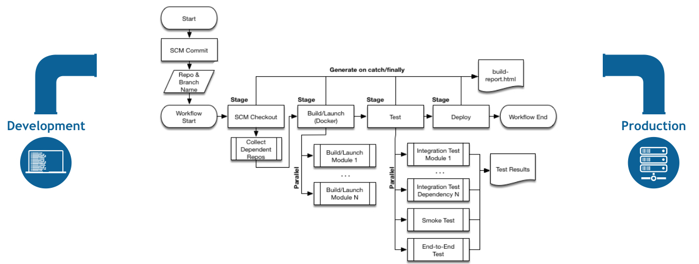

# A Java Maven Calculator Web App
A Java calculator web app, build by Maven, CI/CD



## 1. Manualy Build, Test, and Deploy By Maven

### 1.2 Build
```console
$ mvn clean package -Dmaven.test.skip=true  
...
[INFO] Packaging webapp
[INFO] Assembling webapp [java-maven-calculator-web-app] in [/Users/ricardo/projects/git/geekshubs/academy/devops/java-maven-calculator-web-app/target/calculator]
[INFO] Processing war project
[INFO] Copying webapp resources [/Users/ricardo/projects/git/geekshubs/academy/devops/java-maven-calculator-web-app/src/main/webapp]
[INFO] Webapp assembled in [146 msecs]
[INFO] Building war: /Users/ricardo/projects/git/geekshubs/academy/devops/java-maven-calculator-web-app/target/calculator.war
[INFO] WEB-INF/web.xml already added, skipping
[INFO] ------------------------------------------------------------------------
[INFO] BUILD SUCCESS
[INFO] ------------------------------------------------------------------------
[INFO] Total time:  2.505 s
[INFO] Finished at: 2022-01-08T13:07:22+01:00
[INFO] ------------------------------------------------------------------------
```

### 1.3  Run Locally
```console
$ mvn jetty:run
[INFO] Scanning elapsed time=249ms
[INFO] DefaultSessionIdManager workerName=node0
[INFO] No SessionScavenger set, using defaults
[INFO] node0 Scavenging every 660000ms
[INFO] Started o.e.j.m.p.JettyWebAppContext@1595d2b2{Calculator Web,/calculator,file:///Users/ricardo/projects/git/geekshubs/academy/devops/java-maven-calculator-web-app/src/main/webapp/,AVAILABLE}{file:///Users/ricardo/projects/git/geekshubs/academy/devops/java-maven-calculator-web-app/src/main/webapp/}
[INFO] Started ServerConnector@601d9f3a{HTTP/1.1,[http/1.1]}{0.0.0.0:8080}
[INFO] Started @4228ms
[INFO] Started Jetty Server
```
By default, the jetty port is 8080, so you should visit following urls in browser:
- http://localhost:8080/calculator/api/calculator/ping
- http://localhost:8080/calculator/api/calculator/add?x=8&y=26
- http://localhost:8080/calculator/api/calculator/sub?x=12&y=8
- http://localhost:8080/calculator/api/calculator/mul?x=11&y=8
- http://localhost:8080/calculator/api/calculator/div?x=12&y=12

To run in a different port, `mvn jetty:run -Djetty.port=<Your-Port>`.

To debug locally, `set MAVEN_OPTS=-Xdebug -Xrunjdwp:transport=dt_socket,server=y,address=8000,suspend=n`, then `mvn jetty:run`.

To stop Jetty Server, press Control-C.

### 1.4 Run JUnit Test
```console
$ mvn clean test
[INFO] -------------------------------------------------------
[INFO]  T E S T S
[INFO] -------------------------------------------------------
[INFO] Running com.ricardogarfe.calculator.CalculatorServiceTest
[INFO] Tests run: 5, Failures: 0, Errors: 0, Skipped: 0, Time elapsed: 0.056 s - in com.ricardogarfe.calculator.CalculatorServiceTest
[INFO]
[INFO] Results:
[INFO]
[INFO] Tests run: 5, Failures: 0, Errors: 0, Skipped: 0
[INFO]
[INFO] ------------------------------------------------------------------------
[INFO] BUILD SUCCESS
[INFO] ------------------------------------------------------------------------
[INFO] Total time:  2.579 s
[INFO] Finished at: 2022-01-08T13:08:58+01:00
[INFO] ------------------------------------------------------------------------
```
### 1.5 Run Integration Test
```console
$ mvn clean integration-test
[INFO] -------------------------------------------------------
[INFO]  T E S T S
[INFO] -------------------------------------------------------
[INFO] Running com.ricardogarfe.calculator.CalculatorServiceIT
[INFO] Tests run: 5, Failures: 0, Errors: 0, Skipped: 0, Time elapsed: 0.671 s - in com.ricardogarfe.calculator.CalculatorServiceIT
[INFO]
[INFO] Results:
[INFO]
[INFO] Tests run: 5, Failures: 0, Errors: 0, Skipped: 0
```
### 1.7 Run Performance Test with JMeter
>Important: Jmeter tests are coupled to integration-test phase and run against jetty server (only for test flow purposes)

```console
$ mvn clean verify
[INFO] -------------------------------------------------------
[INFO]  P E R F O R M A N C E    T E S T S
[INFO] -------------------------------------------------------
[INFO]  
[INFO]  
[INFO] Executing test: CalculatorTestPlan.jmx
[INFO] Starting process with:[java, -Xms512M, -Xmx512M, -jar, ApacheJMeter-4.0.jar, -d, /Users/ricardo/projects/git/geekshubs/academy/devops/java-maven-calculator-web-app/target/jmeter, -e, -j, /Users/ricardo/projects/git/geekshubs/academy/devops/java-maven-calculator-web-app/target/jmeter/logs/CalculatorTestPlan.jmx.log, -l, /Users/ricardo/projects/git/geekshubs/academy/devops/java-maven-calculator-web-app/target/jmeter/results/20220108-CalculatorTestPlan.csv, -n, -o, /Users/ricardo/projects/git/geekshubs/academy/devops/java-maven-calculator-web-app/target/jmeter/reports/CalculatorTestPlan_20220108_130928, -t, /Users/ricardo/projects/git/geekshubs/academy/devops/java-maven-calculator-web-app/target/jmeter/testFiles/CalculatorTestPlan.jmx]
[INFO] Creating summariser <summary>
[INFO] Created the tree successfully using /Users/ricardo/projects/git/geekshubs/academy/devops/java-maven-calculator-web-app/target/jmeter/testFiles/CalculatorTestPlan.jmx
[INFO] Starting the test @ Sat Jan 08 13:09:29 CET 2022 (1641643769357)
[INFO] Waiting for possible Shutdown/StopTestNow/Heapdump message on port 4445
[INFO] Warning: Nashorn engine is planned to be removed from a future JDK release
[INFO] summary +      6 in 00:00:01 =    5,8/s Avg:    12 Min:     3 Max:    53 Err:     0 (0,00%) Active: 1 Started: 2 Finished: 1
[INFO] summary +     44 in 00:00:08 =    5,5/s Avg:     2 Min:     1 Max:     5 Err:     0 (0,00%) Active: 0 Started: 10 Finished: 10
[INFO] summary =     50 in 00:00:09 =    5,5/s Avg:     3 Min:     1 Max:    53 Err:     0 (0,00%)
[INFO] Tidying up ...    @ Sat Jan 08 13:09:38 CET 2022 (1641643778718)
[INFO] ... end of run
[INFO] Completed Test: /Users/ricardo/projects/git/geekshubs/academy/devops/java-maven-calculator-web-app/target/jmeter/testFiles/CalculatorTestPlan.jmx
[INFO] ------------------------------------------------------------------------
[INFO] BUILD SUCCESS
[INFO] ------------------------------------------------------------------------
[INFO] Total time:  18.378 s
[INFO] Finished at: 2022-01-08T13:09:39+01:00
[INFO] ------------------------------------------------------------------------
[INFO] Shutdown detected, destroying JMeter process...

```
### 1.8 Start Jmeter GUI (Optional)
If you want to see the test plan, you need install Jmeter, then start Jmeter GUI and open java-maven-calculator-web-app/src/test/jmeter/CalculatorTestPlan.jmx.
```console
$ cd ~/apache/jmeter/bin
$ ./jmeter 
```
Don't use GUI mode for load testing !, only for Test creation and Test debugging.For load testing, use CLI Mode:
Open performance test result csv file `20220108-CalculatorTestPlan.csv`.

## 2. Automatically Build and Test

### 2.1 Create and Configure a Pipeline Jenkins Project
Project name: **JavaMavenCalculator-flow**

Execute the Jenkins Pipeline Script File: Jenkinsfile

### 2.2 Create and Configure Github Actions
**TBC**

### 2.3 Create and Configure Gitlab CICD
**TBC**

## 3. Containerize Your Web App

### 3.1. Build a docker image using Dockerfile:
```console
$ docker build -t myjetty --no-cache -f Dockerfile .
[+] Building 18.9s (11/11) FINISHED
 => [internal] load build definition from Dockerfile                                                                                                                                                                                                                                                                                                                   0.0s
 => => transferring dockerfile: 373B                                                                                                                                                                                                                                                                                                                                   0.0s
 => [internal] load .dockerignore                                                                                                                                                                                                                                                                                                                                      0.0s
 => => transferring context: 2B                                                                                                                                                                                                                                                                                                                                        0.0s
 => [internal] load metadata for docker.io/library/maven:3.6.3-jdk-11                                                                                                                                                                                                                                                                                                  0.0s
 => CACHED [1/6] FROM docker.io/library/maven:3.6.3-jdk-11                                                                                                                                                                                                                                                                                                             0.0s
 => [internal] load build context                                                                                                                                                                                                                                                                                                                                      0.0s
 => => transferring context: 32.65kB                                                                                                                                                                                                                                                                                                                                   0.0s
 => [2/6] RUN adduser --gecos "First Last,RoomNumber,WorkPhone,HomePhone" --disabled-password jetty                                                                                                                                                                                                                                                                    0.5s
 => [3/6] WORKDIR /home/jetty                                                                                                                                                                                                                                                                                                                                          0.0s
 => [4/6] ADD pom.xml /home/jetty                                                                                                                                                                                                                                                                                                                                      0.0s
 => [5/6] ADD src /home/jetty/src                                                                                                                                                                                                                                                                                                                                      0.0s
 => [6/6] RUN mvn package                                                                                                                                                                                                                                                                                                                                             18.0s
 => exporting to image                                                                                                                                                                                                                                                                                                                                                 0.3s
 => => exporting layers                                                                                                                                                                                                                                                                                                                                                0.3s
 => => writing image sha256:261170ef21726e989eccec8d0d525e12a237701b87ddcf228de38710fa45c59f                                                                                                                                                                                                                                                                           0.0s
 => => naming to docker.io/library/myjetty                                                                                                                                                                                                                                                                                                                             0.0s
```

### 3.2. Run docker image locally
```console
$ docker run --rm -p 8080:8080 myjetty
```
>Explain: --rm means delete the container after stopping it.

Access the web app at http://localhost:8080/api/calculator/ping in browser.

Press Control-C to stop and remove the container.

### 3.3. Run docker-compose environment
Define a service to use repository Docker image:
```yaml
version: '3.8'
services:
  calculator:
    build: .
    ports:
      - "8080:8080"
```
Run docker-compose environment:
```console
$ docker-compse up 
```

Access the web app at http://localhost:8080/api/calculator/ping in browser.

## Reference
- [Jenkins Pipeline](https://jenkins.io/doc/book/pipeline/)


